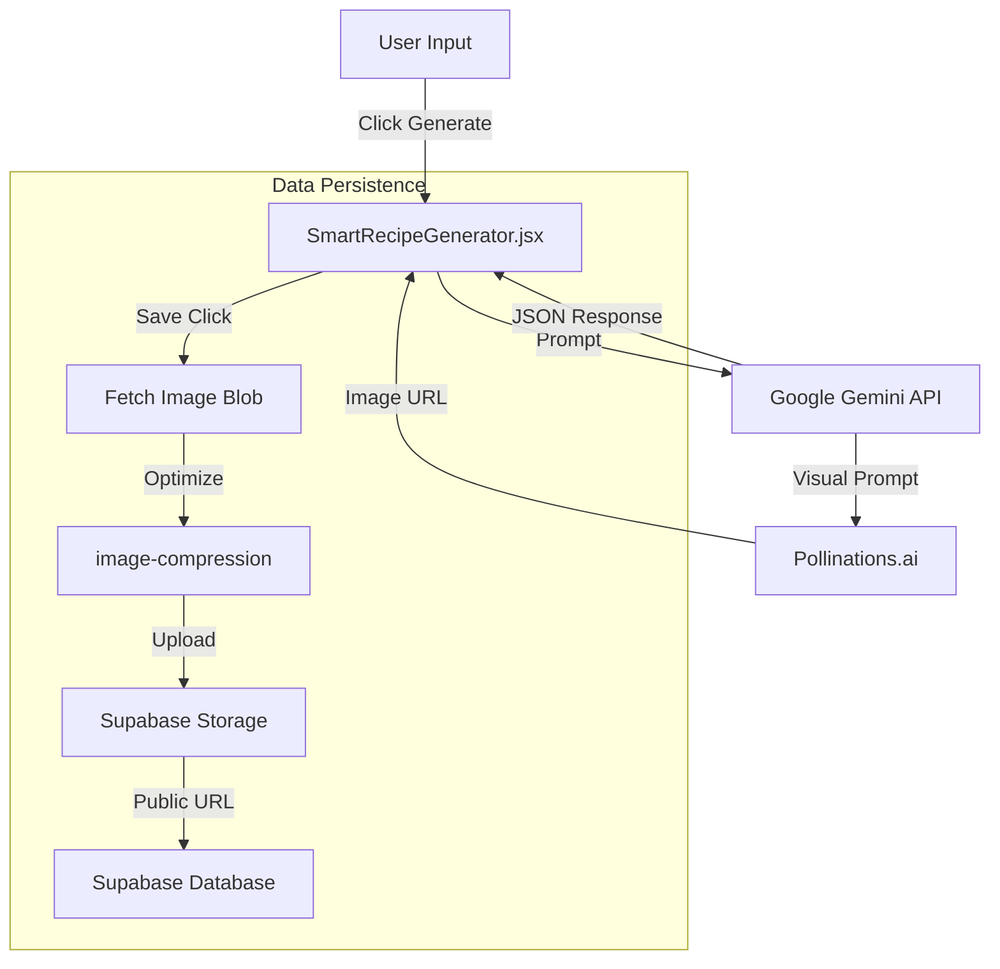

# Smart Recipe Generator - Technical Documentation

## 1. Overview
The **Smart Recipe Generator** is an AI-powered feature that allows users to create custom, detailed recipes based on natural language cravings. It leverages Google's Gemini 1.5 Flash for recipe logic and Pollinations.ai for real-time food imagery, integrating seamlessly with the Nouriva Supabase backend.

## 2. Architecture
The feature follows a client-side AI orchestration pattern, where the React frontend coordinates between the AI services and the database.

## 3. Core Components

### 3.1 Frontend Component (`SmartRecipeGenerator.jsx`)
This is the main orchestration component. It functions as a state machine with the following states:
1.  **Idle**: Displays the "Create Your Dream Meal" card.
2.  **Input**: Modal open, user entering craving.
3.  **Generating**: Awaiting Gemini API response (Spinner).
4.  **Review**: Displaying generated recipe and image for user approval.
5.  **Saving**: Processing image and persisting data.

**Key Features:**
*   **Robust Error Handling**: Wraps all async operations in try-catch blocks with toast notifications.
*   **Image Fallback**: If backend image processing fails, it gracefully falls back to the original external URL or a placeholder.
*   **No-Referrer Policy**: Uses `referrerPolicy="no-referrer"` to prevent privacy-related image loading blocks.

### 3.2 AI Service (`lib/gemini.js`)
Handles the interaction with Google's Generative AI.

*   **Model**: `gemini-1.5-flash`
*   **Prompt Engineering**:
    *   Enforces strict JSON output.
    *   Requests specific fields: `name`, `description`, `ingredients` (object), `steps` (array), `type`, and `visual_prompt`.
    *   **Visual Prompting**: Explicitly asks for a "photorealistic, 4k, food photography" description separate from the recipe text.
*   **Image URL Construction**:
    *   Generates a simplified `Pollinations.ai` URL using the `visual_prompt`.
    *   Strips complex parameters to avoid 403 Forbidden errors.

## 4. Data Flow & Persistence

### 4.1 Generation Phase
1.  User input is sent to `generateFullRecipe`.
2.  Gemini returns a JSON object.
3.  The `visual_prompt` is URL-encoded and appended to `https://image.pollinations.ai/prompt/...`.
4.  The UI renders the image directly from this external URL.

### 4.2 Save Phase (`handleSave`)
To ensure long-term availability of the recipe, we do not rely on the dynamic Pollinations URL.
1.  **Fetch**: The external image is fetched as a `Blob`.
    *   *Timeout Safety*: Using `AbortController` to prevent hanging fetches (8s limit).
2.  **Optimize**: The blob is compressed using `optimizeImage` to reduce storage costs and improve load times.
3.  **Upload**: The optimized image is uploaded to the `images` bucket in Supabase.
4.  **Insert**: A new row is created in the `recipes` table containing the **Supabase Storage Public URL** and all recipe metadata.
5.  **Navigation**: User is redirected to `/app/meal/:id`.

## 5. Security & Stability
*   **CORS Management**: Image fetching is handled carefully to avoid CORS blocks. If the browser blocks the programmatic fetch, the system falls back to saving the external URL directly.
*   **RLS (Row Level Security)**: The generator assumes an authenticated session or public write access depending on configuration.
*   **Rate Limits**: Gemini API usage is subject to quotas; the UI handles failures with generic error toasts.

## 6. Future Improvements
*   **User Personalization**: Inject user dietary preferences (from Profile) into the system prompt.
*   **Regeneration**: Allow users to "Regenerate Image" or "Adjust Recipe" before saving.
*   **Collection Support**: Allow saving directly to a "Meal Plan" or specific collection.
